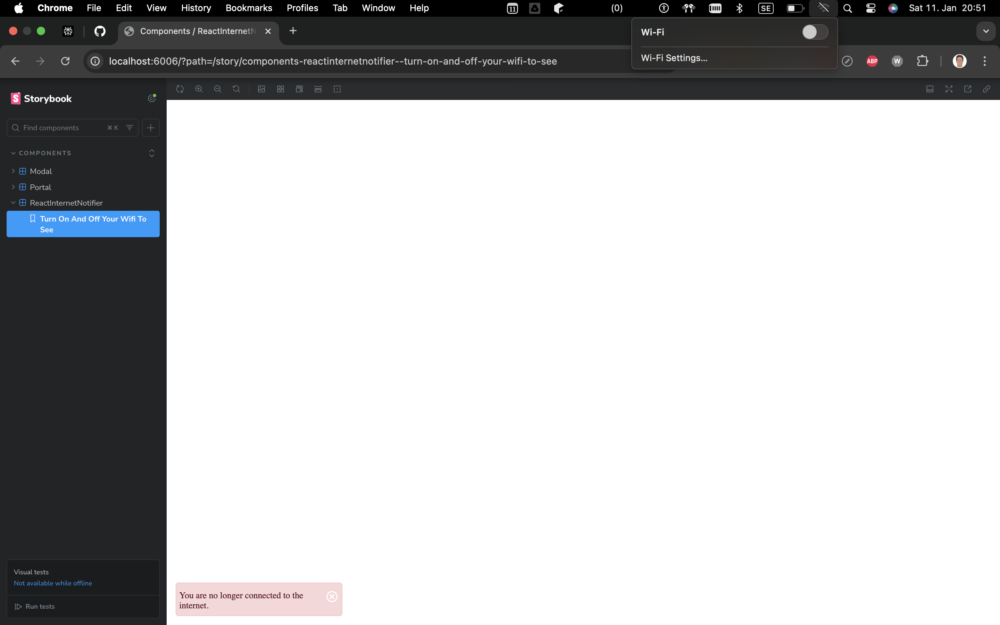
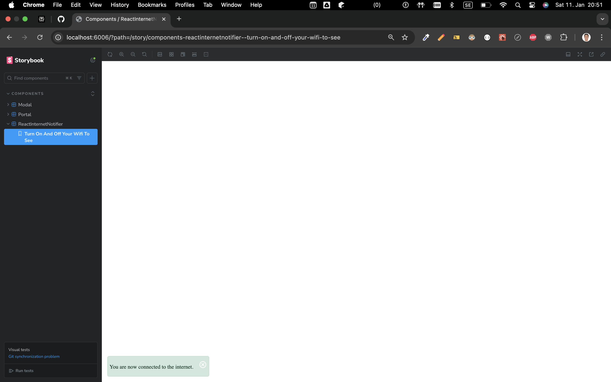
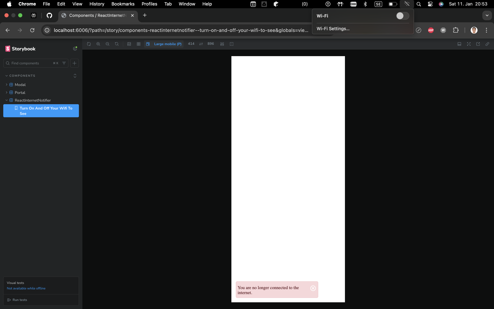
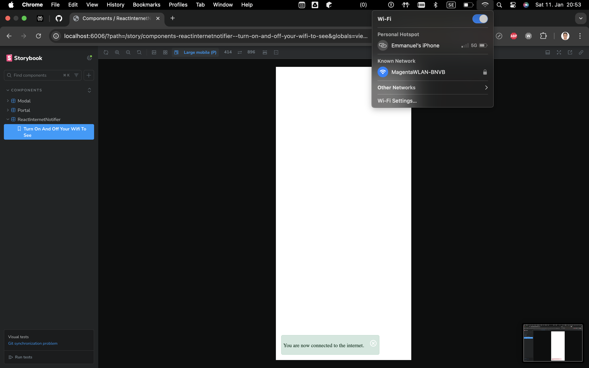

# ReactInternetNotifier

[A lightweight React package for real-time internet connectivity notifications.](https://www.npmjs.com/package/react-internet-notifier)

## Installation

```bash
npm install react-internet-notifier
# or
yarn add react-internet-notifier
```

## Quick Start

```ts
import React from 'react';
import { ReactInternetNotifier } from "react-internet-notifier";

function App() {
  return (
    <div>
      <ReactInternetNotifier />
      {/* Your app components */}
    </div>
  );
}
```

## Features

* 🌐 Real-time internet connection monitoring
* 🔔 Non-intrusive pop-up notifications
* 🚀 Easy one-line integration
* 🌍 Cross-browser compatibility

## Props

| Prop     | Type                                                   | Default  | Description                                                      |
|----------|--------------------------------------------------------|----------|------------------------------------------------------------------|
| duration | number                                                 | 10000    | Duration (in milliseconds) for which the notification is displayed. It's an optional prop. |
| position | "top" \| "bottom" \| "top-center" \| "bottom-center"   | "bottom" | Position of the notification on the screen. It's an optional prop.                      |

## Example with Props

```ts
<ReactInternetNotifier duration={3000} position="top-right" />
```

## Contributing

1. Fork the repository
2. Create feature branch (git checkout -b feature/amazing-feature)
3. Commit changes (git commit -m 'Add amazing feature')
4. Push to branch (git push origin feature/amazing-feature)
5. Open Pull Request

## Preview





